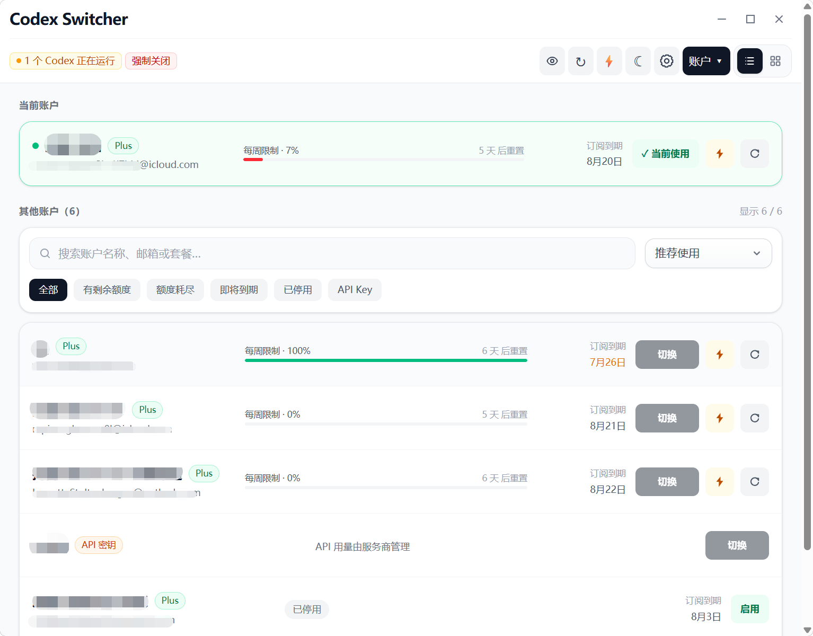

<p align="center">
  
</p>

<h1 align="center">Codex Switcher</h1>

<p align="center">
  一款用于管理多个 OpenAI <a href="https://github.com/openai/codex">Codex</a> 账户的桌面应用程序<br>
  轻松切换账户、监控用量、定时预热，全面掌控配额使用情况
</p>

<p align="center">
  <strong>简体中文</strong> · <a href="README_EN.md">English</a><br>
  <sub>本项目基于 <a href="https://github.com/Lampese/codex-switcher">Lampese/codex-switcher</a> 开发，感谢原作者及贡献者的出色工作。</sub>
</p>

## 功能特性

- **多账户管理** – 一站式添加、重命名、隐藏、导入、导出和管理多个 Codex 账户
- **快速切换** – 从主窗口、原生托盘菜单或托盘弹窗中快速切换账户
- **用量统计** – 查看 OAuth 账户的用量统计，包括生命周期 Token 数、每日用量、连续使用天数、活动洞察和最常用集成
- **手动重置配额** – 在每个账户方案徽章旁查看可用的手动重置配额，临近过期时高亮显示
- **自动预热** – 手动预热单个或所有账户，也可在当前可用的用量窗口重置后自动预热，或按设定的每日时间定时预热
- **系统托盘控制** – 使用托盘弹窗切换账户、查看配额和活跃账户统计、刷新用量、打开主窗口或退出应用
- **托盘显示模式** – 可选择显示带会话百分比的图标、纯文本的小时/周百分比显示，或隐藏托盘图标
- **悬浮窗显示模式** – 支持悬浮窗形式展示账户状态与用量信息，方便随时查看
- **任务栏显示模式** – 可在任务栏中驻留显示，快速访问核心功能
- **macOS Dock 控制** – 可将 Codex Switcher 保留在 Dock 中，或设为仅菜单栏应用，首次关闭时有提示引导，并提供托盘回退方案
- **速率限制监控** – 实时查看 5 小时会话和每周用量、重置时间、配额余额及订阅到期时间
- **阻塞切换恢复** – 检测正在运行的 Codex 会话，在重试账户切换前提供强制关闭流程
- **三模式登录** – 支持 ChatGPT OAuth 认证或导入已有的 `auth.json` 文件，或者API登录

## 界面预览

### 主页面

<p align="center">
  
</p>

<table>
  <tr>
    <td align="center"><strong>悬浮窗</strong></td>
    <td align="center"><strong>悬浮窗-紧凑</strong></td>
    <td align="center"><strong>任务栏模式</strong></td>
  </tr>
  <tr>
    <td align="center"></td>
    <td align="center"></td>
    <td align="center"></td>
  </tr>
</table>

## 安装

### 下载发布版

最简单的安装方式是从 GitHub 最新发布版下载：

[下载最新发布版](https://github.com/windyy0/codex-switcher/releases/latest)

根据你的平台选择对应文件：

- **macOS Apple Silicon：** `Codex.Switcher_*_aarch64.dmg`
- **macOS Intel：** `Codex.Switcher_*_x64.dmg`
- **Windows：** `Codex.Switcher_*_x64-setup.exe` 或 `Codex.Switcher_*_x64_en-US.msi`
- **Linux Debian/Ubuntu：** `Codex.Switcher_*_amd64.deb`
- **Linux AppImage：** `Codex.Switcher_*_amd64.AppImage`
- **Linux RPM：** `Codex.Switcher-*-1.x86_64.rpm`

> **macOS 用户注意：** 当前发布版本未经 Apple 公证。如果 macOS 提示应用已损坏，请将其移至 `/Applications` 并移除隔离标记：
>
> ```bash
> sudo xattr -dr com.apple.quarantine "/Applications/Codex Switcher.app"
> open "/Applications/Codex Switcher.app"
> ```

### 自动更新

Codex Switcher 启动时会检查 GitHub 最新发布版。当有更新的签名更新包可用时，应用会显示更新提示，并可在应用内完成安装。

### 从源码构建

#### 前置条件

- [Node.js](https://nodejs.org/)（v18+）
- [pnpm](https://pnpm.io/)
- [Rust](https://rustup.rs/)

```bash
# 克隆仓库
git clone https://github.com/windyy0/codex-switcher.git
cd codex-switcher

# 安装依赖
pnpm install

# 开发模式运行
pnpm tauri dev

# 构建生产版本
pnpm tauri build
```

> **Windows 用户注意：** `pnpm tauri` 脚本通过 POSIX shell 包装器（`sh ./scripts/tauri.sh`）运行，无法在 PowerShell/CMD 中使用。请改用 `tauri:win` 脚本：`pnpm tauri:win dev` 和 `pnpm tauri:win build`。

构建后的应用位于 `src-tauri/target/release/bundle/`。

### 在浏览器中运行仪表盘

你也可以通过 HTTP 提供构建后的仪表盘，而不是打开 Tauri 窗口。

```bash
# 构建前端并在 0.0.0.0:3210 启动 Web 服务器
pnpm lan
```

可选环境变量：

- `CODEX_SWITCHER_WEB_HOST` – 覆盖绑定的主机地址
- `CODEX_SWITCHER_WEB_PORT` – 覆盖端口号

浏览器仪表盘通过 `/api/invoke/*` 提供相同的 UI 和后端操作，使其可在局域网、Tailscale 或远程主机隧道中安全使用。

## 用量与重置配额

Codex Switcher 展示两种账户用量信息：

- **速率限制** – 账户卡片显示当前 5 小时和每周限制窗口、剩余百分比、重置时间、配额余额以及订阅到期时间（如果可用）。
- **用量统计** – ChatGPT OAuth 账户可展开**用量统计**面板，查看生命周期 Token 数、今日、近 7 天、近 30 天、连续使用天数、最长任务、Token 活动、推理/活动洞察以及最常用集成等数据。活跃账户默认展开此面板，其他账户保持折叠状态。
- **手动重置配额** – 有可用重置配额的 OAuth 账户会在方案徽章旁显示紧凑的徽标，包含可用数量和最近的到期日期。零数量结果会被隐藏，到期前 10 天内显示为琥珀色，3 天内显示为红色。

托盘弹窗中还包括活跃账户今日和近 7 天的紧凑统计信息，与常规速率限制刷新流程分开。

## macOS Dock 与菜单栏模式

在 macOS 上，Codex Switcher 可以选择保留在 Dock 中，或仅驻留在菜单栏中。首次关闭主窗口时，应用会询问你想要的运行方式，并让你选择是否再次显示该提示。

你也可以随时从托盘弹窗或原生托盘菜单中的 **Dock 图标** 选项更改此设置。如果选择**仅菜单栏**，应用会始终保留一个可见的托盘图标，以便你随时重新打开主窗口或切换回 Dock 模式。

## 预热

预热会向账户发送一个最小请求，让当前用量窗口在你需要使用前保持活跃。

- **手动** – 从主窗口或托盘菜单中预热单个或全部账户。
- **自动** – 启用后（针对单个账户或全部账户），应用会优先跟踪 5 小时窗口，并在每次重置后自动预热，前提是每周限制尚未耗尽。如果当前只有周窗口，则在每周重置后预热一次；若 5 小时窗口重新出现，会自动恢复原来的预热节奏。
- **定时** – 从主窗口的**定时**控件中设置特定的每日时间（例如 `08:00`、`13:00`、`18:00`）。应用会在每个设定时间预热所有账户（跳过每周限制已耗尽的账户），让你掌控 5 小时窗口的起始时间，而不是任其漂移。

定时预热每 30 秒检查一次计划，每个配置的时间每天仅运行一次。如果机器处于睡眠状态错过了设定时间，则不会在之后补预热。

在 macOS 上，你可以使用内置的 `caffeinate` 命令防止机器休眠，该命令会在应用退出时自动停止：

```bash
caffeinate -i -w "$(pgrep -x 'Codex Switcher')"
```

## 免责声明

本工具**专为个人拥有多个 OpenAI/ChatGPT 账户的用户**设计，旨在帮助用户更方便地管理自己的账户。

**本工具不适用于以下场景：**

- 在多个用户之间共享账户
- 规避 OpenAI 的服务条款
- 任何形式的账户共用或凭据共享

使用本软件即表示你同意你是添加到应用程序中的所有账户的合法所有者。作者对任何滥用行为或违反 OpenAI 服务条款的行为不承担任何责任。

## 开发与发布

### 更新日志

- 开发中的内容只写入 `CHANGELOG.md` 的 `[未发布]` 和 `CHANGELOG.en.md` 的 `[Unreleased]`，两份文件使用相同的版本记录和对应语言内容。
- 发布前先提交当前代码；发布脚本要求工作区干净，不需要手动改版本号或移动日志章节。
- 发布脚本会自动把未发布内容归档到版本号和日期下，创建新的未发布章节，并生成中英文 Release Notes。

### 版本与发布命令

# 创建发布提交、标签并推送；也可传入明确版本号，如 0.106.0
pnpm release patch -- --push
pnpm release 0.106.0 -- --push
```

推送 `vX.Y.Z` 标签后，GitHub Actions 会校验中英文日志、构建各平台安装包、生成签名和 `latest.json`，全部成功后才会发布 GitHub Release。
